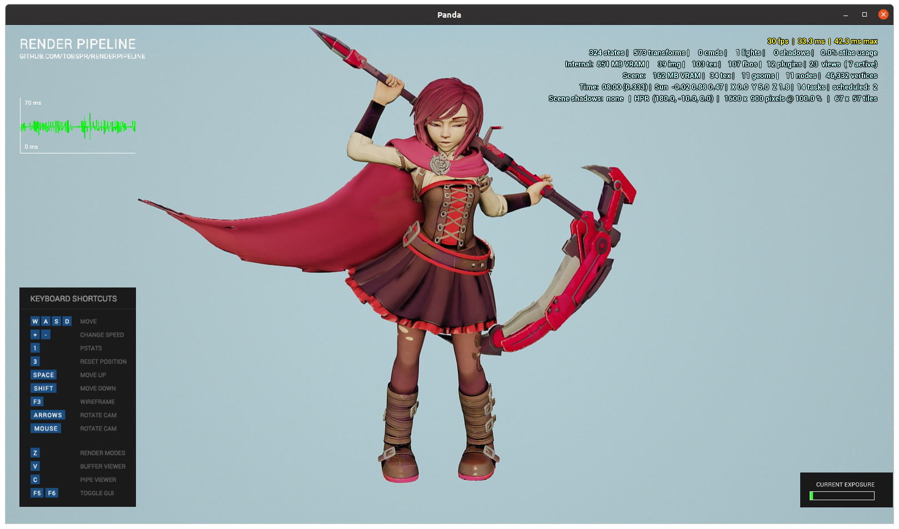

KITSUNETSUKI Asset Tools
========================

Collection of asset tools designed for automated pipeline.


Installation
------------

```
pip install .
```


Using examples
--------------

The model included is not made by myself.
The model was made by theStoff - https://sketchfab.com/3d-models/ruby-rose-2270ee59d38e409491a76451f6c6ef80

Convert models from BLEND file:
```
make -C examples/ruby_rose
```

Open converted models using Panda3D and RenderPipelie (from EGG format):
```
python examples/ruby_rose/scene_rp_egg.py
```

Open converted models using Panda3D and RenderPipelie (from glTF format):
```
python examples/ruby_rose/scene_rp_gltf.py
```





Expected material nodes setup
-----------------------------


blend2egg
---------

BLEND to EGG (Panda3D model format) converter.

Features:
* Export [RenderPipeline](https://github.com/tobspr/RenderPipeline) materials
* Export Blender-calculated tangents-bitangents
* Export NodePath "tags" from json-encoded Blender text blocks
* Skeletal animations

Usage:
```
blend2egg --output x.egg x.blend
```


blend2gltf
----------

BLEND to [glTF](https://github.com/KhronosGroup/glTF) converter.
Uses custom glTF properties and extensions targeting [Panda3D glTF loader](https://github.com/Moguri/panda3d-gltf).

Features:
* Export [RenderPipeline](https://github.com/tobspr/RenderPipeline) materials
* Export Blender-calculated tangents-bitangents
* Export NodePath "tags" from json-encoded Blender text blocks

It's still in experimental state, so some features are still broken:
* Can't export animations
* Can't export specular map

Usage:
```
blend2egg --output x.gltf x.blend
```
