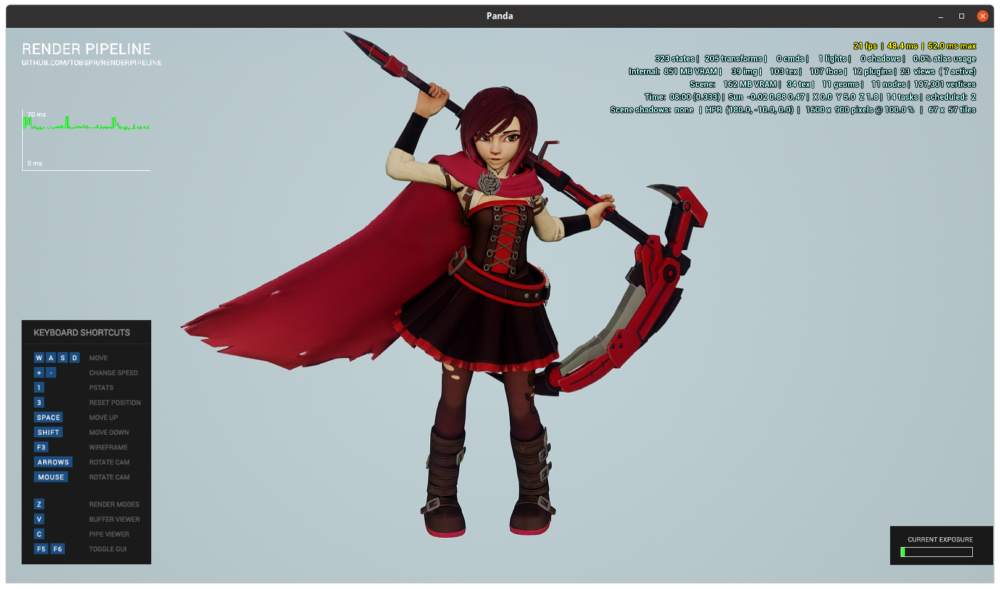

KITSUNETSUKI Asset Tools
========================

Collection of asset tools designed for automated pipeline.


Installation
------------

**Installing into [Anaconda](https://www.anaconda.com/products/individual) / [Miniconda](https://docs.conda.io/en/latest/miniconda.html) Python**

This is an easiest way to install.
It uses [prebuilt](https://anaconda.org/kitsune.ONE/python-blender) Blender's Python module from Anaconda Cloud.
You can also [build](https://github.com/kitsune-ONE-team/KITSUNETSUKI-SDK/tree/master/conda/blender) one by yourself.

```
conda install -c kitsune.one python-blender
pip install git+https://github.com/kitsune-ONE-team/KITSUNETSUKI-Asset-Tools.git
```


**Installing into Python**

This is the most difficult way to install.
You have to find the Blender's Python module or build it by yourself.

```
pip install git+https://github.com/kitsune-ONE-team/KITSUNETSUKI-Asset-Tools.git
```


**Installing into [Blender](https://www.blender.org/download/) Python**

The installation process is a little bit tricky for this one.
You need to install Python modules into Blender's Python and run Python scripts with Blender.
You can't run scripts which depends on Panda3D, for example *blend2egg*.

```
2.83/python/bin/python3.7m -m ensurepip
2.83/python/bin/python3.7m -m pip install git+https://github.com/kitsune-ONE-team/KITSUNETSUKI-Asset-Tools.git
```


**Running asset tools from [Blender](https://www.blender.org/download/) Python**

```
blender -b -P 2.83/python/lib/python3.7/site-packages/kitsunetsuki/blend2gltf.py model.blend -o model.gltf
```


Using examples
--------------

Original model made by theStoff:

https://sketchfab.com/3d-models/ruby-rose-2270ee59d38e409491a76451f6c6ef80

Convert models from BLEND file:
```
make -C examples/ruby_rose
```

Open converted models using Panda3D and RenderPipeline (from EGG format):
```
python examples/ruby_rose/scene_rp_egg.py
```

Open converted models using Panda3D and RenderPipeline (from glTF format):
```
python examples/ruby_rose/scene_rp_gltf.py
```





Expected material nodes setup
-----------------------------

Supported texture maps as BSDF inputs for RenderPipeline materials:
* Base Color
* Specular
* Roughness
* Normal Map

Supported BSDF input values as RenderPipeline material params:
* Metallic (RenderPipeline uses values 0 and 1 only)
* Roughness
* Normal Map Strength (from Normal Map Node)

Some input values could be specified as separate Math Nodes.


NodePath tags setup
-------------------

You can define object's tags using json-encoded Blender text blocks with the same name as an object.


pview output (notice the "hp" and "type" tags):
```
GeomNode mesh_ruby (1 geoms: S:(MaterialAttrib TextureAttrib)) [hp type] T:m(scale 10000)
```

python usage example:
```
ruby_mesh = self.ruby.find('**/=type=body')
print('hp', ruby_mesh.get_tag('hp'))
```
outputs:
```
hp 100
```

blend2egg
---------

BLEND to EGG (Panda3D model format) converter.

Features:
* Export [RenderPipeline](https://github.com/tobspr/RenderPipeline) materials
* Export Blender-calculated tangents-bitangents
* Export NodePath "tags" from json-encoded Blender text blocks
* Skeletal animations

EGG export requirements:
* Panda3D (1.10.6+) for EGG generation
* python-blender (2.81+) (Blender as Python module) or Blender's Python

Exporting models:
```
blend2egg --output x.egg x.blend
```

Exporting animations (from Blender actions):
```
blend2egg --output x_action_name.egg --export animation --action action_name x.blend
```


blend2gltf
----------

BLEND to [glTF](https://github.com/KhronosGroup/glTF) converter.
Uses custom glTF properties and extensions targeting [Panda3D glTF loader](https://github.com/Moguri/panda3d-gltf).

Features:
* Export [RenderPipeline](https://github.com/tobspr/RenderPipeline) materials
* Export Blender-calculated tangents-bitangents
* Export NodePath "tags" from json-encoded Blender text blocks
* Skeletal animations

It's still in experimental state, so some features are still broken:
* Can't export specular maps

glTF export requirements:
* python-blender (2.81+) (Blender as Python module) or Blender's Python

glTF loading requirements:
* panda3d-gltf (0.7+)

Exporting models:
```
blend2egg --output x.gltf x.blend
```


gltf-inspect
------------

Tiny tool for browsing glTF file's structure.

Usage:
```
gltf-inspect ruby_mesh.gltf
```

Output:
```
 [R] Scene
  + [S] Object <RST>
  |  + [J] Bip001_Root <RST>
  |  |  + [J] Bip001_Pelvis <RST>
  |  |  |  + [J] Bip001_Belt <RST>
  |  |  |  |  + [J] Bip001_BeltBck <RST>
  |  |  |  |  + [J] Bip001_BeltFrt <RST>
  |  |  |  |  + [J] Bip001_Belt_L <RST>
  |  |  |  |  |  + [J] Bip001_Round <RST>
  |  |  |  |  |  + [J] Bip001_Round1 <RST>
  |  |  |  |  |  + [J] Bip001_Round2 <RST>
  |  |  |  |  |  + [J] Bip001_Round3 <RST>
  |  |  |  |  |  + [J] Bip001_Round4 <RST>
  |  |  |  |  |  + [J] Bip001_Round5 <RST>
  |  |  |  |  |  + [J] Bip001_Round6 <RST>
  |  |  |  |  + [J] Bip001_Belt_R <RST>
  |  |  |  |  + [J] Bip001_Mount_Belt <RST>

...

  |  |  |  + [J] Bip001_Thigh_L <RST>
  |  |  |  |  + [J] Bip001_Thigh1_L <RST>
  |  |  |  |  |  + [J] Bip001_Thigh2_L <RST>
  |  |  |  |  |  |  + [J] Bip001_Thigh3_L <RST>
  |  |  |  |  |  |  |  + [J] Bip001_Calf_L <RST>
  |  |  |  |  |  |  |  |  + [J] Bip001_Calf1_L <RST>
  |  |  |  |  |  |  |  |  |  + [J] Bip001_Calf2_L <RST>
  |  |  |  |  |  |  |  |  |  |  + [J] Bip001_Calf3_L <RST>
  |  |  |  |  |  |  |  |  |  |  |  + [J] Bip001_Foot_L <RST>
  |  |  |  |  |  |  |  |  |  |  |  |  + [J] Bip001_Toe_L <RST>
  |  |  |  |  |  |  |  |  |  |  |  |  |  + [J] Bip001_ToeNub_L <RST>
  |  |  |  |  |  |  |  + [J] Bip001_Knee_L <RST>
  |  |  |  + [J] Bip001_Thigh_R <RST>
  |  |  |  |  + [J] Bip001_Thigh1_R <RST>
  |  |  |  |  |  + [J] Bip001_Thigh2_R <RST>
  |  |  |  |  |  |  + [J] Bip001_Thigh3_R <RST>
  |  |  |  |  |  |  |  + [J] Bip001_Calf_R <RST>
  |  |  |  |  |  |  |  |  + [J] Bip001_Calf1_R <RST>
  |  |  |  |  |  |  |  |  |  + [J] Bip001_Calf2_R <RST>
  |  |  |  |  |  |  |  |  |  |  + [J] Bip001_Calf3_R <RST>
  |  |  |  |  |  |  |  |  |  |  |  + [J] Bip001_Foot_R <RST>
  |  |  |  |  |  |  |  |  |  |  |  |  + [J] Bip001_Toe_R <RST>
  |  |  |  |  |  |  |  |  |  |  |  |  |  + [J] Bip001_ToeNub_R <RST>
  |  |  |  |  |  |  |  + [J] Bip001_Knee_R <RST>
  |  + [N] mesh_bullet {skin: Object (368 joints), mesh: mesh_bullet}
  |  + [N] mesh_bullet1 {skin: Object (368 joints), mesh: mesh_bullet1}
  |  + [N] mesh_crescentRose {skin: Object (368 joints), mesh: mesh_crescentRose}
  |  + [N] mesh_ruby {skin: Object (368 joints), mesh: mesh_ruby}
  |  + [N] mesh_rubyBelt {skin: Object (368 joints), mesh: mesh_rubyBelt}
  |  + [N] mesh_rubyCloak {skin: Object (368 joints), mesh: mesh_rubyCloak}
  |  + [N] mesh_rubyEyeAO {skin: Object (368 joints), mesh: mesh_rubyEyeAO}
  |  + [N] mesh_rubyEyes {skin: Object (368 joints), mesh: mesh_rubyEyes}
  |  + [N] mesh_rubyHair {skin: Object (368 joints), mesh: mesh_rubyHair}
  |  + [N] mesh_rubyPouch {skin: Object (368 joints), mesh: mesh_rubyPouch}
```


makecard
--------

Card maker tool. This is alternative to **egg-texture-cards** included with Panda3D.

Makes sprite-based animations, but automatically packs all images into a single spritesheet texture.

Create a single animation from 4 frames:
```
makecard --frames 4 --fps 10 --output anim.egg --input 1.png 2.png 3.png 4.png
```

Create 2 animations (first animations have 2 frames, and second one is 3 frames):
```
makecard --frames 2,3 --fps 15 --output anim.egg --input a1.png a2.png b1.png b2.png b3.png
```

